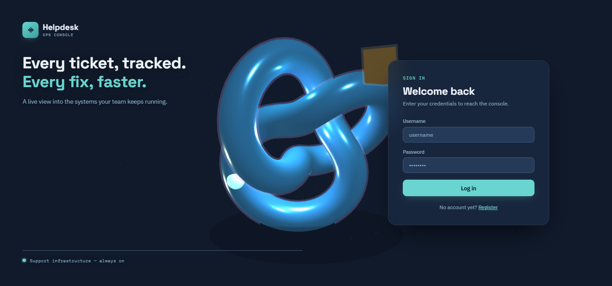
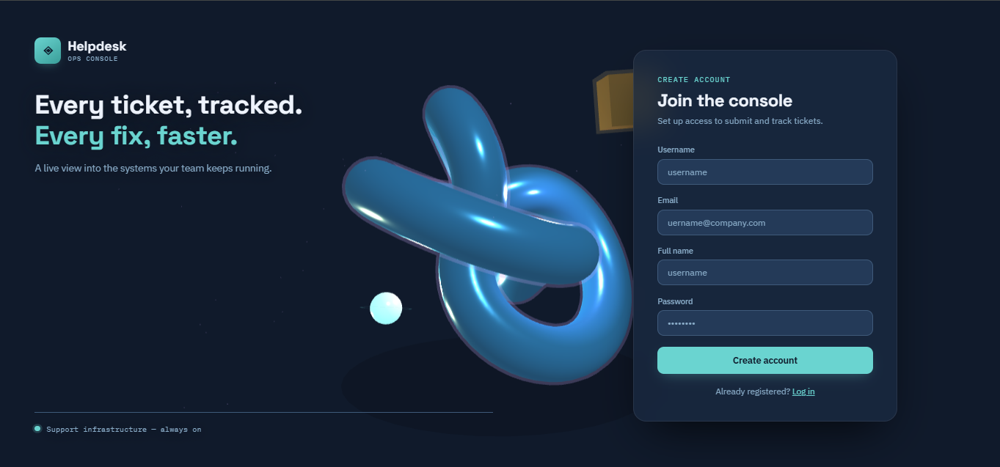
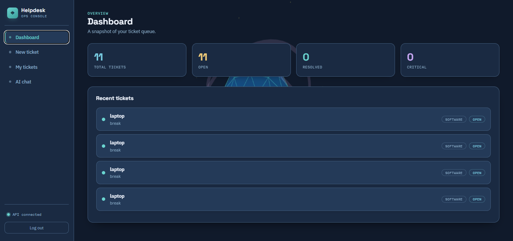

# 🛠️ Secure IT Helpdesk AI

An AI-powered IT Helpdesk system built with **FastAPI**, **LangChain**, and **Ollama**. The application allows users to create and manage IT support tickets while interacting with an AI chatbot powered by Retrieval-Augmented Generation (RAG) for intelligent troubleshooting.
---

## ✨ Features

- 🔐 User Authentication (Register & Login)
- 🤖 AI-powered IT Support Assistant
- 🎫 Ticket Management System
- 📄 Retrieval-Augmented Generation (RAG)
- 📚 Document Retrieval
- 👥 Role-Based Access Control
- ⚡ RESTful API with FastAPI
- 💾 SQLite Database
- 🦙 Local LLM using Ollama
- 📖 Swagger API Documentation

---

## 🛠️ Tech Stack

### Backend

- FastAPI
- Python 3.11
- SQLAlchemy
- SQLite
- Pydantic
- Uvicorn

### AI Stack

- Ollama
- Llama 3.2
- LangChain
- ChromaDB
- Nomic Embeddings

### Frontend

- HTML
- CSS
- JavaScript

---

# 📂 Project Structure

```text
secure-it-helpdesk-ai/
│
├── app/
│   ├── api/
│   ├── database/
│   ├── rag/
│   ├── security/
│   ├── services/
│   ├── utils/
│   └── main.py
│
├── tests/
├── frontend.html
├── requirements.txt
├── README.md
└── .gitignore
```

---

# 🚀 Installation

## 1️⃣ Clone Repository

```bash
git clone https://github.com/Alishba-Haroon/secure-it-helpdesk-ai.git

cd secure-it-helpdesk-ai
```

---

## 2️⃣ Create Virtual Environment

Windows

```bash
python -m venv venv
```

Activate

```bash
venv\Scripts\activate
```

Linux / macOS

```bash
source venv/bin/activate
```

---

## 3️⃣ Install Dependencies

```bash
pip install -r requirements.txt
```

---

# 🦙 Install Ollama

Download Ollama:

https://ollama.com/download

Pull required models

```bash
ollama pull llama3.2
ollama pull nomic-embed-text
```

Verify

```bash
ollama list
```

Expected output

```text
llama3.2
nomic-embed-text
```

---

# ▶️ Run Backend

```bash
uvicorn app.main:app --reload
```

Backend URL

```
http://127.0.0.1:8000
```

Swagger Documentation

```
http://127.0.0.1:8000/docs
```

---

# 🌐 Run Frontend

```bash
python -m http.server 5500
```

Open

```
http://127.0.0.1:5500/frontend.html
```

---

# ⚙️ Environment Variables

Create a `.env` file.

```env
SECRET_KEY=your_secret_key

DATABASE_URL=sqlite:///./helpdesk.db

OLLAMA_BASE_URL=http://localhost:11434

LLM_MODEL=llama3.2

EMBEDDING_MODEL=nomic-embed-text
```

---

# 📸 Screenshots

## 🔐 Login Page



---

## 📝 Register Page



---

## 🏠 Dashboard



---

## 🎫 Ticket Management


---

## 🤖 AI Chat Assistant


---

# 📡 API Endpoints

## Authentication

| Method | Endpoint |
|---------|----------|
| POST | /register |
| POST | /login |

---

## Tickets

| Method | Endpoint |
|---------|----------|
| GET | /tickets |
| POST | /tickets |
| PUT | /tickets/{id} |
| DELETE | /tickets/{id} |

---

## AI Chat

| Method | Endpoint |
|---------|----------|
| POST | /chat |

---

# 🔮 Future Improvements

- PostgreSQL Support
- Email Notifications
- Docker Deployment
- Admin Dashboard
- Analytics Dashboard
- Multi-user Chat History
- JWT Refresh Tokens
- Better RAG Optimization

---

## 📄 License

This project is licensed under the **MIT License**.

See the [LICENSE](LICENSE) file for complete license details.

---

